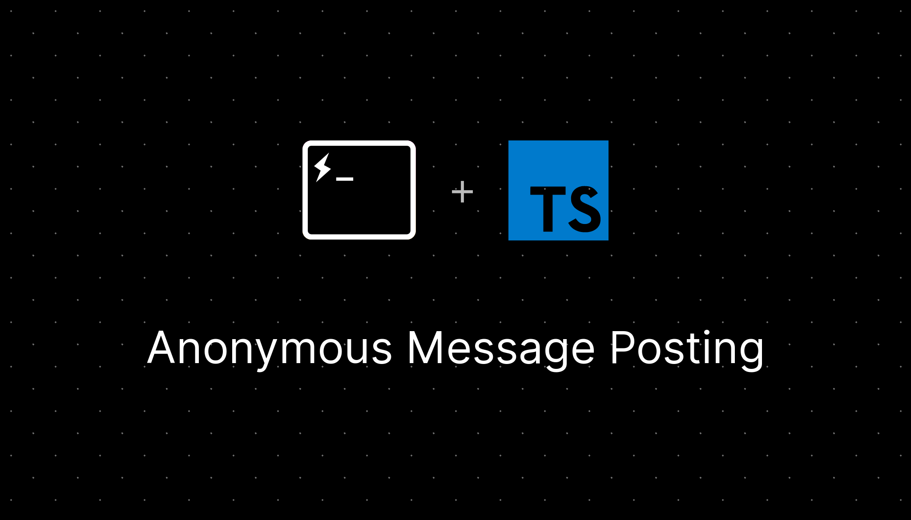

<br />
<p align="center">
  
  <p align="center">

  <div align="center">
    <a href="https://discord.gg/thinkfiveable">
      
    </a>
    <a href="https://github.com/ThinkFiveable/discord-bot-template/actions/workflows/lint.yml">
      
    </a>
  </div>

  <div align="center">
    Template for Discord.js/Discord-akairo based Fiveable Discord bots
    <br />
    <a href="https://github.com/thinkfiveable/discord-bot-template/issues">Report Bug</a>
    ·
    <a href="https://github.com/thinkfiveable/discord-bot-template/issues">Request Feature</a>
    ·
    <a href="https://github.com/thinkfiveable/discord-bot-template/pulls">Send a Pull Request</a>
    </p>
  </div>
</p>

# 📝 What is this?
This repository houses the code for Discord.js/Discord-akairo based Fiveable Discord bots. It includes boilerplate code for a functioning Discord bot. It does *not* include any database type structures for sake of flexibility with the boilerplate code.

# 📝Commands

| Command              	| Description                                                                      	|
|----------------------	|----------------------------------------------------------------------------------	|
| `eval`              	| Run some code through your bot                                                   	|
| `help`              	| Get information on all the commands your bot has.                               	|

# 🚧 Getting Started

## ENV variables
Please supply the following ENV variables in a `.env` file in the root of the project.

| Key                  	| Description                                                       	| Optional 	|
|----------------------	|-------------------------------------------------------------------	|----------	|
| TOKEN                	| The token belonging to the Discord bot                            	|          	|
| PREFIX               	| Prefix for the bot                                                	|          	|
| GUILD                	| The guild this bot is meant to function in                        	|          	|
| ADMIN_ID             	| ID of the admin of this bot. Bypasses<br>all cooldowns/ratelimits 	|     ✔️    |

## Setup
You can setup this project manually using the steps below, or using the include docker-compose file by doing `docker compose up -d --build`. There is also an included `heroku.yml` file for deploying to Heroku, which should build with the Dockerfile provided.

```
git clone https://github.com/ThinkFiveable/discord-bot-template.git   
cd discord-bot-template
npm install  
npm run build  
```
Be sure to fill in the env variables as seen [here](#env-variables)  

To start the bot, run this command:
```console
npm run start
```

## LICENSE

This license can also be found [here](https://github.com/ThinkFiveable/discord-bot-template/blob/main/LICENSE)

```
MIT License

Copyright (c) 2021 Fiveable

Permission is hereby granted, free of charge, to any person obtaining a copy
of this software and associated documentation files (the "Software"), to deal
in the Software without restriction, including without limitation the rights
to use, copy, modify, merge, publish, distribute, sublicense, and/or sell
copies of the Software, and to permit persons to whom the Software is
furnished to do so, subject to the following conditions:

The above copyright notice and this permission notice shall be included in all
copies or substantial portions of the Software.

THE SOFTWARE IS PROVIDED "AS IS", WITHOUT WARRANTY OF ANY KIND, EXPRESS OR
IMPLIED, INCLUDING BUT NOT LIMITED TO THE WARRANTIES OF MERCHANTABILITY,
FITNESS FOR A PARTICULAR PURPOSE AND NONINFRINGEMENT. IN NO EVENT SHALL THE
AUTHORS OR COPYRIGHT HOLDERS BE LIABLE FOR ANY CLAIM, DAMAGES OR OTHER
LIABILITY, WHETHER IN AN ACTION OF CONTRACT, TORT OR OTHERWISE, ARISING FROM,
OUT OF OR IN CONNECTION WITH THE SOFTWARE OR THE USE OR OTHER DEALINGS IN THE
SOFTWARE.
```